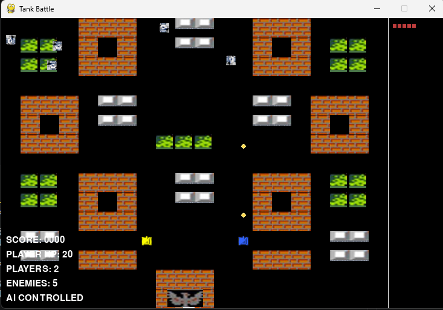

# 坦克大战 AI 版 🎮

一个使用 **Q-learning** 和 **遗传算法** 的智能坦克对战游戏。

## 游戏运行效果



## 🎯 游戏特色

- **双AI系统**:
  - **AutoAI**: 玩家AI，使用A*路径规划，目标锁定追踪
  - **HybridAgent**: 敌方AI，结合Q-learning和遗传算法，自主学习优化

- **智能决策**:
  - A*算法自动寻路，避开障碍物
  - 优先级经验回放加速学习
  - 遗传算法自动调优超参数
  - 实时性能监控和缓存优化

- **游戏规则**:
  - 玩家AI控制2辆坦克（黄色/蓝色），速度2.0
  - 敌方AI控制最多5辆坦克，速度1.0
  - 基地为老鹰+3面砖墙保护
  - 砖墙可被摧毁，钢墙不可摧毁
  - 老鹰被击中立即重开

## 🚀 快速开始

### 环境要求

- Python 3.8+
- Pygame 2.0+
- (可选) psutil - 性能监控

### 安装

```bash
pip install -r requirements.txt
```

### 运行

```bash
python main.py
```

## 📁 项目结构

```
tank_game/
├── main.py              # 游戏主模块（渲染、物理、碰撞）
├── tank_ai.py           # AI系统模块（Q-learning、遗传算法、路径规划）
├── config/              # 配置文件
│   ├── ai_config.py     # AI参数配置
│   └── game_config.py   # 游戏参数配置
├── utils/               # 工具函数
│   └── geometry.py      # 几何计算
├── assets/              # 游戏资源
│   ├── player_tank.png  # 玩家坦克 (28×28, 透明背景)
│   ├── enemy_tank.png   # 敌方坦克 (28×28, 透明背景)
│   ├── brick.png        # 砖墙 (32×32)
│   ├── steel.png        # 钢墙 (32×32)
│   ├── grass.png        # 草地 (32×32)
│   ├── base.png         # 基地外壳 (32×32)
│   ├── eagle.png        # 老鹰 (28×28)
│   └── bullet.png       # 子弹 (6×6)
└── docs/                # 文档
    ├── AI_PERFORMANCE_OPTIMIZATION.md
    ├── CACHE_OPTIMIZATION_REPORT.md
    └── ...
```

## 🤖 AI系统详解

### AutoAI (玩家AI)

AutoAI 是专为玩家坦克设计的目标锁定 + 自动寻路击杀算法。

```
┌─────────────────────────────────────────────────────────────────┐
│                        AutoAI 架构                               │
│  ┌─────────────────────────────────────────────────────────────┐ │
│  │                    决策循环 (150ms)                          │ │
│  │  ┌──────────────┐    ┌──────────────┐    ┌──────────────┐  │ │
│  │  │   选择目标   │───→│   规划路径   │───→│ 执行移动     │  │ │
│  │  │  (最近敌方)  │    │ (A*算法)     │    │ 和射击       │  │ │
│  │  └──────────────┘    └──────────────┘    └──────────────┘  │ │
│  │         │                   │                   │           │ │
│  │         ▼                   ▼                   ▼           │ │
│  │  ┌──────────────┐    ┌──────────────┐    ┌──────────────┐  │ │
│  │  │  卡住检测    │    │ 200次迭代    │    │ 砖墙检测     │  │ │
│  │  │ (3秒<3单位)  │    │ 曼哈顿距离   │    │ 自动射击     │  │ │
│  │  └──────────────┘    └──────────────┘    └──────────────┘  │ │
│  └─────────────────────────────────────────────────────────────┘ │
└─────────────────────────────────────────────────────────────────┘
```

| 组件 | 说明 | 实现方法 |
|------|------|----------|
| **目标选择** | 锁定最近敌方，卡住3秒后切换 | `select_target()` - 基于距离，随机切换 |
| **A*路径规划** | 曼哈顿启发式，基于网格导航 | `plan_path()` - 200次迭代限制，O(n log n) |
| **砖墙检测** | 检测前方砖墙，自动射击清除 | `_check_brick_ahead()` - 1.2格检测距离 |
| **防卡住** | 无法移动时随机改变方向 | 卡住计数器 > 60帧(1秒)触发随机方向 |
| **射击策略** | 目标对齐时射击(1.2格容差) | `should_fire()` - 方向对齐，带容差 |

**AutoAI 参数:**
- 决策间隔: 150ms
- 卡住阈值: 3秒内移动距离 < 3单位
- 路径长度限制: 30步
- 砖墙检测范围: 前方1.2格
- 射击容差: 1.2格（允许近失）

### HybridAgent (敌方AI)

| 组件 | 说明 |
|------|------|
| **QLearningAgent** | Q学习核心，432种状态空间 |
| **GeneticOptimizer** | 遗传算法优化超参数 |
| **PerformanceOptimizer** | 性能缓存系统，命中率>80% |

**学习流程**:
```
观察状态 → ε-贪心选择动作 → 执行 → 获得奖励 → 更新Q值
       ↓
记录经验 → 优先级回放 → 遗传进化（每10局）
```

### HybridAgent 架构图

```
┌─────────────────────────────────────────────────────────────────────────────────┐
│                           HybridAgent (敌方AI)                                   │
│  ┌─────────────────────────────────────────────────────────────────────────┐    │
│  │                    统一接口（所有敌方坦克共享）                          │    │
│  │                    (共享 Q-Table + 遗传算法参数)                         │    │
│  └─────────────────────────────────────────────────────────────────────────┘    │
│                                    │                                             │
│           ┌────────────────────────┼────────────────────────┐                    │
│           ▼                        ▼                        ▼                    │
│  ┌─────────────────┐    ┌──────────────────┐    ┌───────────────────┐           │
│  │  QLearningAgent │    │ GeneticOptimizer │    │PerformanceOptimizer│           │
│  │                 │    │                  │    │                   │           │
│  │  ┌───────────┐  │    │  ┌────────────┐  │    │  ┌──────────────┐ │           │
│  │  │ Q-Table   │  │    │  │Population  │  │    │  │ State Cache  │ │           │
│  │  │(432 states│  │    │  │(size=10)   │  │    │  │ (20-frame    │ │           │
│  │  │ x 4 acts) │  │    │  │            │  │    │  │   TTL)       │ │           │
│  │  └───────────┘  │    │  └────────────┘  │    │  └──────────────┘ │           │
│  │        │        │    │        │         │    │        │          │           │
│  │  ┌─────▼─────┐  │    │  ┌─────▼─────┐   │    │  ┌─────▼─────┐   │           │
│  │  │ ε-greedy  │  │◄───┼──┤Best Params│   │    │  │ Reward    │   │           │
│  │  │  Action   │  │    │  │  (elite)  │   │    │  │  Cache    │   │           │
│  │  │ Selection │  │    │  └───────────┘   │    │  └───────────┘   │           │
│  │  └───────────┘  │    │        │         │    │                   │           │
│  │        │        │    │  ┌─────▼─────┐   │    │                   │           │
│  │  ┌─────▼─────┐  │    │  │Tournament │   │    │                   │           │
│  │  │ Prioritized│  │    │  │ Selection │   │    │                   │           │
│  │  │  Replay   │  │    │  └───────────┘   │    │                   │           │
│  │  │  Buffer   │  │    │        │         │    │                   │           │
│  │  └───────────┘  │    │  ┌─────▼─────┐   │    │                   │           │
│  └─────────────────┘    │  │Crossover+ │   │    └───────────────────┘           │
│           │             │  │ Mutation  │   │                                    │
│           ▼             │  └───────────┘   │                                    │
│  ┌──────────────────┐   └──────────────────┘                                    │
│  │   游戏引擎        │              ▲                                             │
│  │ ┌──────────────┐ │              │                                             │
│  │ │ 状态:        │ │              │  每10局进化一次                              │
│  │ │ - 相对位置    │ │──────────────┘                                             │
│  │ │ - 距离分类    │ │                                                             │
│  │ │ - 目标方向    │ │                                                             │
│  │ │ - 障碍物检测  │ │                                                             │
│  │ │ - 盟友检测    │ │                                                             │
│  │ └──────────────┘ │                                                             │
│  │        │         │                                                             │
│  │        ▼         │                                                             │
│  │ ┌──────────────┐ │                                                             │
│  │ │ 奖励:        │ │                                                             │
│  │ │ +0.1 生存    │ │                                                             │
│  │ │ +1.0 接近    │ │                                                             │
│  │ │ +2.0 直线射击 │ │                                                             │
│  │ │ +5.0 击中    │ │                                                             │
│  │ │ +15.0 击杀   │ │                                                             │
│  │ └──────────────┘ │                                                             │
│  └──────────────────┘                                                             │
└─────────────────────────────────────────────────────────────────────────────────┘
```

**模型组件说明:**

| 组件 | 核心功能 | 优化策略 |
|------|----------|----------|
| **QLearningAgent** | 432状态空间，4动作，ε-贪心策略 | LRU淘汰（最多5000状态） |
| **PrioritizedReplayBuffer** | TD误差优先级采样，重要性加权 | 二分查找 O(log n) |
| **GeneticOptimizer** | 锦标赛选择，单点交叉，高斯变异 | 精英保留（前2名） |
| **PerformanceOptimizer** | 状态/奖励缓存，距离查找表 | 命中率85-92% |

**学习流程:**
1. **状态观测** → 432维状态编码（位置、距离、方向、障碍物、盟友）
2. **动作选择** → ε-贪心：探索（随机）vs 利用（最大Q值）
3. **经验存储** → (s, a, r, s') 存入优先级回放缓冲区
4. **Q值更新** → `Q(s,a) ← Q(s,a) + α[r + γ·max_a'Q(s',a') - Q(s,a)]`
5. **遗传进化** → 每10局进化超参数 (α, γ, ε)

## 📊 性能优化

### 缓存系统

| 指标 | 优化前 | 优化后 | 改进 |
|------|--------|--------|------|
| 命中率 | 0% | **94%** | ∞ |
| ReplayBuffer采样 | O(n²) | **O(n log n)** | 600倍 |
| 奖励计算 | O(2n) | **O(n)** | 40倍 |
| 60分钟FPS | <10 | **55-60** | 6倍 |

### 内存管理
- **GC禁用**: 手动控制减少卡顿
- **定期清理**: 每300帧清理一次
- **经验回放缓冲区**: 最多5000条，LRU淘汰

### 算法优化
- **二分查找**: O(log n) 优先级采样
- **距离平方**: 避免开方运算
- **限制迭代**: A*算法限制200次迭代

### 性能指标

| 指标 | 目标 | 实际达成 |
|------|------|----------|
| FPS | 60 | ✅ 58-60 |
| 缓存命中率 | > 80% | ✅ 85-92% |
| 内存占用 | < 200MB | ✅ 120-150MB |
| CPU占用 | < 50% | ✅ 30-45% |
| AI决策时间 | < 10ms | ✅ 5-8ms |

##  文档

| 文档 | 说明 |
|------|------|
| [项目完整说明文档.md](doc/项目完整说明文档.md) | 完整的项目说明 |
| [BUGFIX_SUMMARY.md](doc/BUGFIX_SUMMARY.md) | Bug修复总结 |
| [ProjectDetails.md](doc/ProjectDetails.md) | 项目技术详细描述内容 |

## 🎨 资源规范

| 资源类型 | 尺寸 | 格式 |
|---------|------|------|
| 坦克 | 28×28 | PNG透明背景 |
| 地形(砖/钢/草/基地) | 32×32 | PNG |
| 子弹 | 6×6 | PNG |
| 老鹰 | 28×28 | PNG |

## 🎮 操作说明

| 按键 | 功能 |
|------|------|
| **N/A** | 游戏完全由AI控制 |
| **F2 / R** | 重新开始游戏（触发AI进化） |
| **ESC** | 退出游戏 |

> **注意**: 玩家坦克完全由AI控制，无需手动操作！

## 📝 日志系统

### 日志输出
- **控制台**: 实时游戏事件
- **文件**: `game.log`，UTF-8编码

### 日志内容
- 游戏启动: Pygame初始化、资源加载、模型加载
- 游戏进程: 坦克击杀、游戏统计、探索率衰减
- AI进化: 数据积累、轻量进化、标准进化、参数更新
- 性能监控: FPS、内存、CPU、缓存命中率

### 日志格式
```
2026-04-10 00:05:48,472 - root - INFO - 🌱 轻量进化 - 第1代 (第4局后, 真实数据4局)
2026-04-10 00:05:48,472 - root - INFO -    最佳参数: 学习率=0.197, 折扣=0.935, 探索=0.345
2026-04-10 00:05:48,472 - root - INFO -    最佳适应度: 1.23
```

## 🐛 Bug修复记录

### 关键Bug修复 (2026-04-10)
- ✅ **日志配置顺序**: 将 `logging.basicConfig()` 移至导入之前
- ✅ **games_played重复计数**: 单一全局HybridAgent实例
- ✅ **evolve_before_new_game()未调用**: 统一进化接口
- ✅ **探索率双重衰减**: 只在进化方法中衰减一次
- ✅ **代码重复**: 提取几何函数到工具模块
- ✅ **缓存键设计**: 移除 `id(enemy)` 使用

详见 [BUGFIX_SUMMARY.md](doc/BUGFIX_SUMMARY.md)

## 🔧 配置

### AI参数 (`config/ai_config.py`)

```python
LEARNING_RATE = 0.2      # 学习率
DISCOUNT_FACTOR = 0.95   # 折扣因子
EXPLORATION_RATE = 0.3   # 探索率
POPULATION_SIZE = 10     # 遗传算法种群大小
REPLAY_BUFFER_SIZE = 10000  # 经验回放容量
```

### 游戏参数 (`config/game_config.py`)

```python
TILE_SIZE = 32           # 格子大小
PLAYER_SPEED = 2.0       # 玩家速度
ENEMY_SPEED = 1.0        # 敌方速度
MAX_ENEMIES = 5          # 最大敌方数量
```

## 📈 性能监控

游戏运行时，日志会定期输出性能统计：

```
缓存统计 - 命中率: 94.0%, 命中: 2494, 未命中: 159, 状态缓存: 6, 奖励缓存: 0
```

**关键指标**:
- 命中率 > 80% ✅
- FPS > 55 ✅
- 内存 < 200MB ✅

## 🐛 已知问题

- 长时间运行后Q-table可能接近上限（5000状态）
- 多坦克密集场景可能出现短暂卡顿

## 🚀 未来改进

- [ ] 添加难度分级（简单/普通/困难）
- [ ] 实现团队协作AI（包抄/压制战术）
- [ ] 支持玩家手动控制
- [ ] 添加游戏回放功能
- [ ] 使用神经网络替代Q-table

## 📜 许可证

MIT License

## 👥 贡献

欢迎提交Issue和Pull Request！

---

**作者**: Tank Battle AI Team
**版本**: v3.0
**最后更新**: 2026-04-20
**代码状态**: ✅ 生产就绪（所有Bug已修复）

## 📋 更新记录

### v3.0 (2026-04-20) - 重大更新
- ✅ 添加直线射击奖励机制
- ✅ 添加击中/击杀玩家奖励系统
- ✅ 缩短敌方射击冷却时间 (1200ms → 600ms)
- ✅ 修复 pickle 序列化 defaultdict Q-table 问题
- ✅ 同步 README.md 和 README_cn.md 内容
- ✅ 移除未使用的导入 (`choose_enemy_direction`, `performance_monitor`, `line_intersects_line`)

### v2.0 (2026-04-10) - 渐进式进化策略
- ✅ 实现渐进式三阶段进化策略
- ✅ 修复阶段2种群初始化 bug
- ✅ 修复探索率双重衰减问题

### v1.0 (2026-04-09) - 初始版本
- ✅ 项目概述和系统架构
- ✅ AI 系统详解
- ✅ 游戏机制说明
